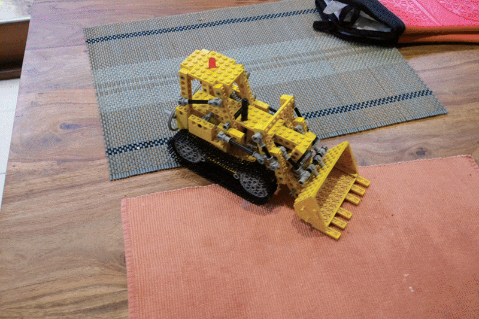
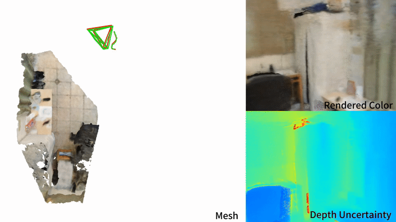
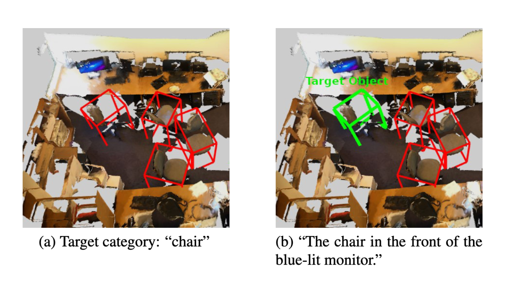

I am a researcher in the Augmented Reality department at German Research Center for AI ([DFKI](https://www.dfki.de/en/web/research/research-departments/augmented-vision/)) in Germany, under the supervision of [Alain Pagani](https://sites.google.com/site/alainpagani/) and [Didier Stricker](https://av.dfki.de/members/stricker/). My research topic is 3D vision and reconstruction. Feel free to reach out if you're interested in my concurrent research or just want to have a casual chat! :D

I received my Master’s degree in Mechatronics from the Karlsruhe Institute of Technology (KIT), during which I conducted a 6-month thesis project in efficient computer vision at [BMW Group](https://www.bmwgroup.com/en/innovation/automated-driving.html) with Lukas Frickenstein, under the supervision of [Jürgen Becker](https://www.itiv.kit.edu/21_53.php) at KIT and [Walter Stechele](https://www.ce.cit.tum.de/lis/stechele/) at TU Munich. Prior to KIT, I obtained a Bachelor’s degree in Mechatronics from Harbin Institute of Technology ([HIT](https://en.hit.edu.cn/)).

## Publications

    

        
    

    

        <h3 style="margin-top: 0;">Inpaint360GS: Efficient Object-Aware 3D Inpainting via Gaussian Splatting for 360° Scenes</h3>
        
<strong>Shaoxiang Wang</strong>, <a href="https://www.linkedin.com/in/shihong-zhang-97861a293/">Shihong Zhang</a>, <a href="https://chris10m.github.io/">Christen Millerdurai</a>, <a href="https://www.professoren.tum.de/westermann-ruediger">Rüdiger Westermann</a>,
        <a href="https://av.dfki.de/members/stricker/">Didier Stricker</a>, <a href="https://sites.google.com/site/alainpagani/">Alain Pagani</a>

        
<em>WACV 2026 </em>

        

            <a href="https://arxiv.org/abs/2412.00242">[arXiv]</a>
            <a href="https://github.com/dfki-av/inpaint360gs">[code]</a>
            <a href="https://shaoxiang777.github.io/project/inpaint360gs/">[website]</a>
        

        
We enable multi-object removal and consistent 360° scene completion for your scene!

    

    

        
    

    

        <h3 style="margin-top: 0;">Uni-SLAM: Uncertainty-Aware Neural Implicit SLAM for Real-Time Dense Indoor Scene Reconstruction</h3>
        
<strong>Shaoxiang Wang</strong>, <a href="https://scholar.google.com/citations?user=3ZKuh9EAAAAJ&hl=en">Yaxu Xie</a>, <a href="https://chunpeng-chang.github.io/">Chun-Peng Chang</a>, <a href="https://chris10m.github.io/">Christen Millerdurai</a>, <a href="https://sites.google.com/site/alainpagani/">Alain Pagani</a>, <a href="https://av.dfki.de/members/stricker/">Didier Stricker</a>

        
<em>WACV 2025</em>

        

            <a href="https://arxiv.org/abs/2412.00242">[arXiv]</a>
            <a href="https://github.com/dfki-av/Uni-SLAM">[code]</a>
            <a href="https://shaoxiang777.github.io/project/uni-slam/">[website]</a>
        

        
Reweight supervision with predictive uncertainty and adapt mapping to achieve accurate real-time indoor reconstruction.

    

    

        
    

    

        <h3 style="margin-top: 0;">MiKASA: Multi-Key-Anchor & Scene-Aware Transformer for 3D Visual Grounding</h3>
        
<a href="https://chunpeng-chang.github.io/">Chun-Peng Chang</a>, <strong>Shaoxiang Wang</strong>, <a href="https://sites.google.com/site/alainpagani/">Alain Pagani</a>, <a href="https://av.dfki.de/members/stricker/">Didier Stricker</a>

        
<em>CVPR 2024</em>

        

            <a href="https://arxiv.org/abs/2403.03077">[arXiv]</a>
            <a href="https://github.com/dfki-av/MiKASA-3DVG">[code]</a>
            <a href="https://birdy666.github.io/projects/mikasa/">[website]</a>
        

        
We introduce multi-key-anchor attention to better capture spatial relationships.

    

<!-- bundle exec jekyll serve -->
